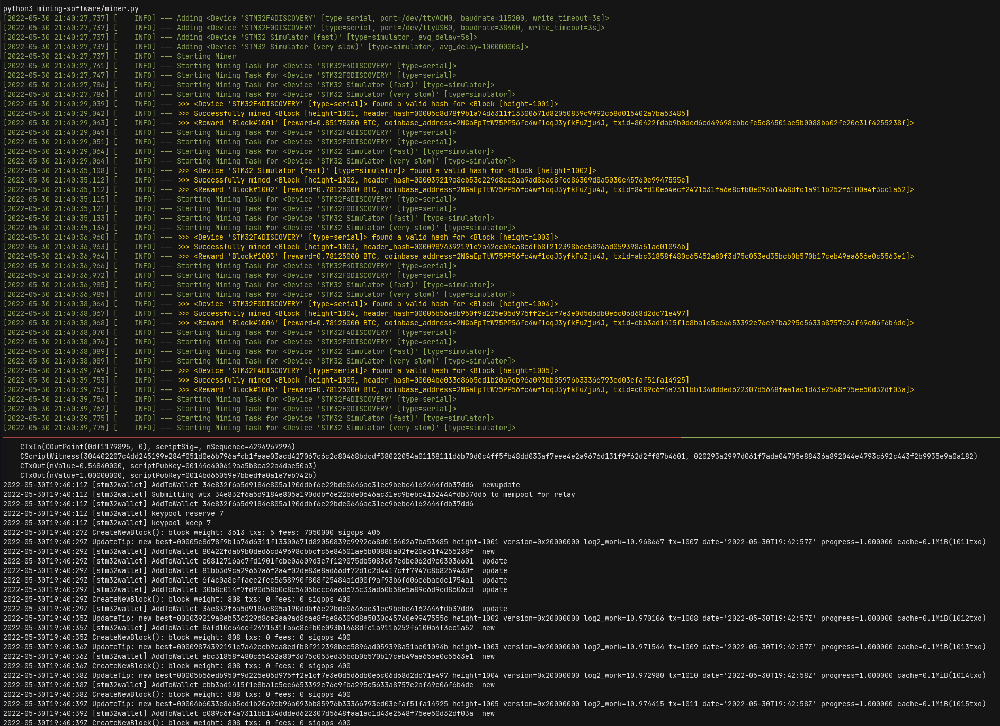

# Bitcoin Solo Mining on Microcontrollers

## Overview
Mining via Proof of Work (PoW) secures the Bitcoin network and allows nodes to reach consensus. During this process miners validate transactions and are rewarded with newly minted bitcoin if they find a solution to the computationally-intense PoW puzzle. Mining hardware that solves this puzzle has become very sophisticated over the years, resulting in highly-efficient ASIC miners with hashrates of several TH/sec that collaborate in large mining pools.

However this project looks at the very lower end of mining devices, where the PoW calculations are performed on a **microcontroller unit (MCU)**. With the current network difficulty this strategy is obviously *not profitable* and the MCU miner will certainly not find a valid PoW. Nevertheless it's fun, cheap and you can learn a lot about some of the inner workings of Bitcoin.

### Solo Mining Workflow

We focus on solo mining where the miner tries to create new blocks on its own (as opposed to pooled mining where miners pool their resources to find blocks more often).

In order to cope with the low hash rate (and to make mining on MCUs a little more entertaining), the MCUs use an **adjusted difficulty** to find a valid nonce, i.e. a share. The difficulty is chosen so that the MCU will find a valid hash every few seconds on average. The bitcoin network difficulty will be significantly greater than the adjusted difficulty, whereas for the regtest network the adjusted difficulty will be inevitably greater. Based on the measured hashrate we choose a target hash of `0x0000FFFF...FFFF` for each share.

##### BITCOIND
For developing and testing new applications we prefer Bitcoin Core's **regtest** mode since it allows us to create a new private block chain instantly. Additionally, in regtest mode the network difficulty is fixed at the lowest possible difficulty (target hash `0x7FF...FF`) which allows instant block creation. Regtest is also more entertaining since we can easily mine new blocks with our slow MCU miners and see everything in full action. However it is still possible to connect the mining software to *bitcoind* running on mainnet, with a slight less exciting outcome.

##### MINING SOFTWARE
The mining software is built from scratch in python with some usage of [bitcoinlib](https://bitcoinlib.readthedocs.io/en/latest/). Compared to other more sophisticated mining softwares targeting ASICs, e.g. [bfgminer](https://github.com/luke-jr/bfgminer) or [cgminer](https://github.com/ckolivas/cgminer), this version is designed specifically for MCUs with very low hashrates. This simplifies certain assumptions, e.g. no extra nonce is necessary, which results in a constant coinbase transaction and therefore constant merkle root.

As illustrated, the mining software polls *bitcoind* for a block template, which includes a list of new transactions, using the getblocktemplate RPC. Subsequently, it uses this template to create a new block and sends the blockheader to the MCU miner. Upon reception of a nonce, the software validates the nonce against the actual difficulty of the block and, if valid, sends the new block to *bitcoind*. If no nonce was received after a certain timeout exceeds, the mining process continues with a new block template.

##### MCU MINER
In general any MCU or development board can be used as a mining device, as long as it supports basic I/O. Additionally, the firmware needs a corresponding mining device class in the miner software that implements the interface `MiningDevice` (see [mining_device.py](/mining-software/mining_device.py)).
At its core, the MCU receives work from the mining software over some I/O interface and will try to find a valid nonce as long as no new data is received or the full 32 bit range of the nonce is depleted. On success it will send back the nonce to the mining software.

## Setup

### Software Requirements
- The mining-software requires `python` >= 3.6.  
  Install the necessary packages, e.g. via `pip3 install -r mining-software/requirements.txt`.
- The mining-firmware uses [PlatformIO](https://docs.platformio.org/en/latest/core/index.html) as build system. Install the latest PlatformIO Core with `pip3 install -U platformio`.
- For serial communication make sure that you have permissions to access the serial port, e.g. temporarily with `sudo chmod 666 /dev/ttyACM0` or permanently by adding your user to the `dialout` or `uucp` group (e.g. `sudo usermod -a -G uucp $USER`).

### Supported Hardware
More devices will be added in future releases. So far only the STM32F4DISCOVERY board is supported. However, it is relatively simple to add support for more STM32 devices with only a few changes to the firmware code (see also [stm32-util](mining-firmware/lib/stm32_util)).

- **[STM32F4DISCOVERY](https://docs.platformio.org/en/latest/boards/ststm32/disco_f407vg.html)** (platformio env: `disco_f407vg`, hashrate: 12 kH/sec)
  - **Details**: The firmware is based on [libopencm3](https://github.com/libopencm3/libopencm3) using the USB CDC ACM protocol to emulate a serial port over USB. When the mining software sends data, it will be received through a callback that is invoked by the USB stack interrupt handler. This ensures that the miner will always operate on the newest available blockheader without any delay.
  - **Setup**: For flashing the firmware connect USB cable 'Type-A to Mini-B' through USB connector CN1. Use the USB Micro-AB connector CN5 for the virtual COM port. Optional serial output is provided by the USART2 port (TX=PA2, RX=PA3).

If you don't have any of the mentioned hardware, it is possible to enable an MCU simulator in the config of the mining software.

## Usage
For convenience, check out the provided `Makefile` that bundles common tasks into simple shortcuts.

### bitcoind
`make run-regtest`: Downloads [Bitcoin Core](https://bitcoincore.org/bin/) and starts *bitcoind* regtest mode with config `bitcoin.conf` and data directory */tmp/bitcoind/*. Subsequent calls will reuse this directory if it exists.  
`make reset-regtest`: Deletes the data directory */tmp/bitcoind/* in order to start a new regtest.  
`make init-regtest`: Should be executed before starting the mining software. Performs some initialization tasks on a running *bitcoind* regtest instance (wallet creation, generation of random blocks and transactions, generation of address to be used for coinbase).

### mining-firmware
Set `LOG_LEVEL=0` in `platformio.ini` to deactivate serial output.

`make flash-firmware`: Build and flash firmware.  
`make debug-firmware`: Build and flash firmware with debugging symbols and verbose serial output enabled.  
`make test-firmware`: Build and run unittests on device.  
`make monitor-firmware`: Monitor device output.

### mining-software
The mining software is configured via [config.toml](mining-software/config.toml) or CLI parameters (see `python3 miner.py --help` for more details). CLI arguments will overwrite values defined in `config.toml`.

`make start-mining`: Starts the mining software with default parameters defined in `config.toml`.  
`make test-mining`: Runs the test suite on the device defined in [test_config.toml](mining-software/tests/test_config.toml).  

**Screenshot of regtest solo mining with STM32F4DISCOVERY board** (Click for larger image)

*top:* Logging output of mining-software, *bottom-left:* Serial output of STM32 board, *bottom-right:* Output of bitcoind regtest

## Future Releases
- [ ] Add [longpoll](https://en.bitcoin.it/wiki/BIP_0022#Optional:_Long_Polling) support
- [ ] Add autodetection of miners
- [ ] Add support for more development boards
- [ ] Add support for mining on multiple (different) MCUs at once
- [ ] Optimize sha256d on stm32 with fast Cortex-M4 assembly code
- [ ] Add solo mining pool support (e.g. solo.ckpool.org)

## License
*btcminer-mcu* is released under the terms of the GNU General Public License (GPL), version 3. See [COPYING](COPYING) for more
information or see https://www.gnu.org/licenses/gpl-3.0.
